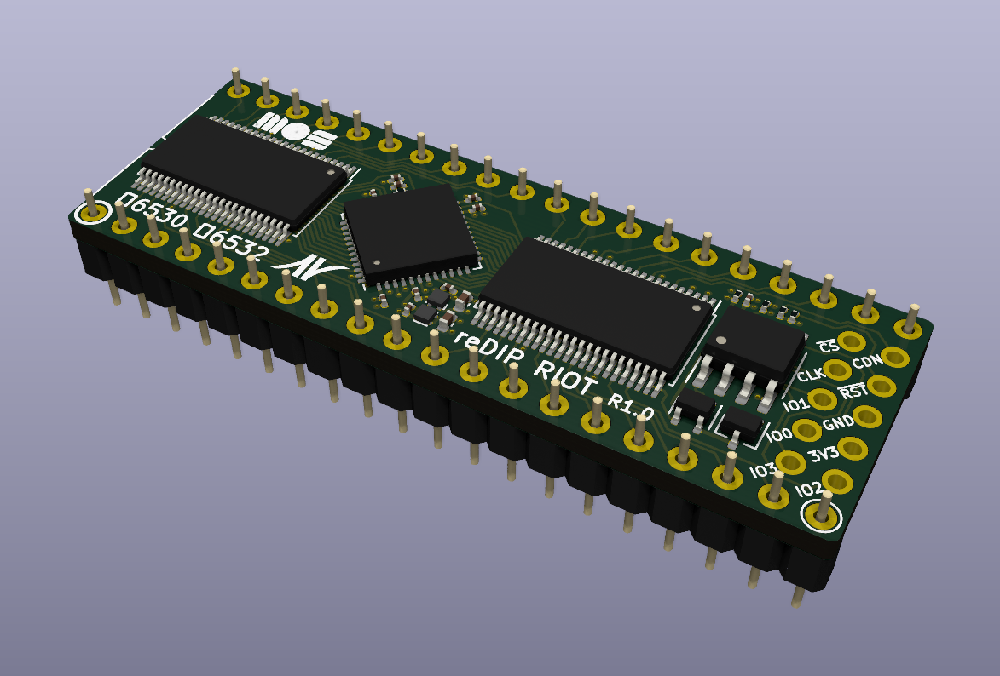
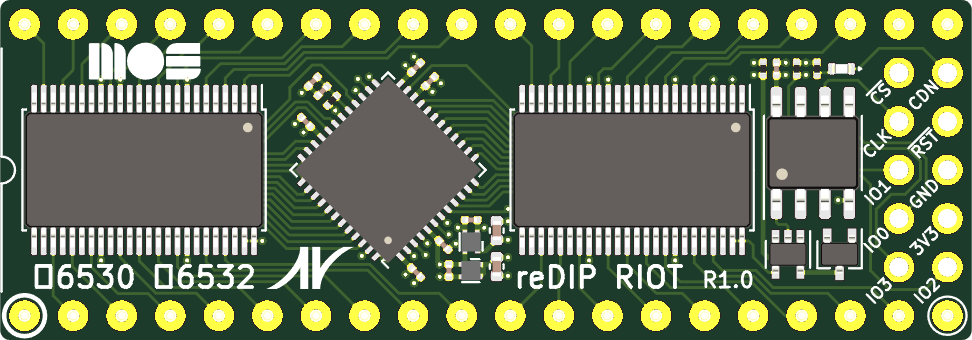
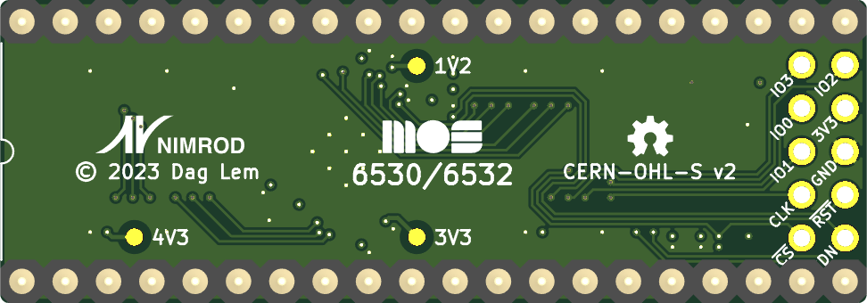

# reDIP RIOT

## MOS 6530 RRIOT / MOS 6532 RIOT FPGA replacement

## Overview
The reDIP RIOT is an open source FPGA board which combines the following in a DIP-40 size package:

* Lattice iCE5LP1K FPGA
* 1Mbit FLASH
* 5V tolerant I/O

The reDIP RIOT provides an open source hardware platform for 6530 RRIOT / MOS 6532 RIOT replacements.

Designs for the iCE5LP1K FPGA can be processed by [yosys](https://github.com/YosysHQ/yosys/) and [nextpnr](https://github.com/YosysHQ/nextpnr/).

## I/O interfaces

### DIP-40 header pins:

* 5V input
* 35 FPGA GPIO
* 3 FPGA open-drain I/O
* GND

All I/O is 5V tolerant, and can drive 5V TTL.

### SPI / programming header:

A separate header footprint is provided for (Q)SPI flash programming, with pinout borrowed from the [iCEBreaker Bitsy](https://github.com/icebreaker-fpga/icebreaker).

## Board Front

## Board Back

